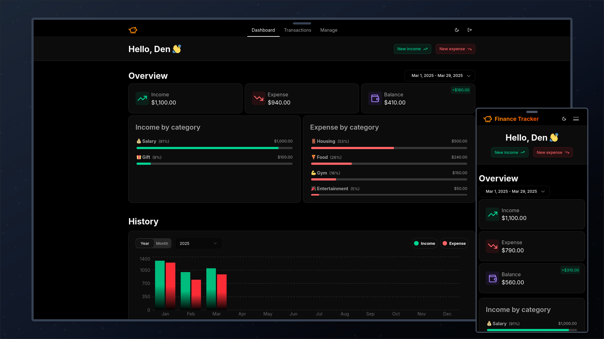

# Finance Tracker

A modern, user-friendly finance tracking application built with Next.js. This app allows users to monitor their income and expenses, categorize transactions, and visualize financial insights through charts.

[**Try it out here**](https://finance-tracker-pi-one.vercel.app)

[](screenshots/preview.png)

## Features

- Track income and expenses with a sleek, intuitive UI
- Group transactions by custom categories
- Visualize financial data with interactive charts
- Secure user authentication

## Tech Stack

- **Frontend & Framework**: Next.js, Shadcn UI
- **Languages & Tools**: TypeScript, Prisma, PostgreSQL, TanStack Query, Zod, Auth.js

## Project Goal

The primary goal of this project is to gain hands-on experience with Next.js while building a functional and visually appealing application.

## Getting Started

### Prerequisites
Ensure you have the following installed:
- Node.js (>= 20)
- pnpm (recommended)

### Installation

1. Clone the repository:
```bash
git clone https://github.com/nullox/finance-tracker
```

2. Navigate to the project folder:
```bash
cd finance-tracker
```

3. Install dependencies:
```bash
pnpm install
```

4. Configure environment variables:
- Copy `.env.example` to `.env`
- Fill in the required values

5. Run the development server:
```bash
pnpm dev
```

## Licence

This project is licensed under the MIT License.